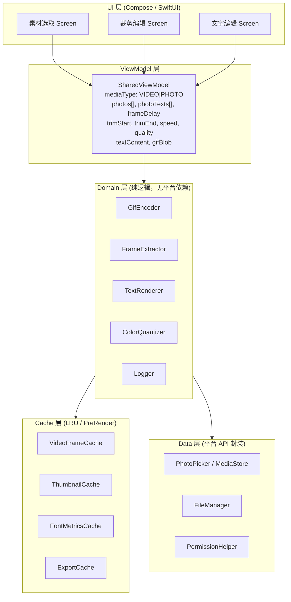
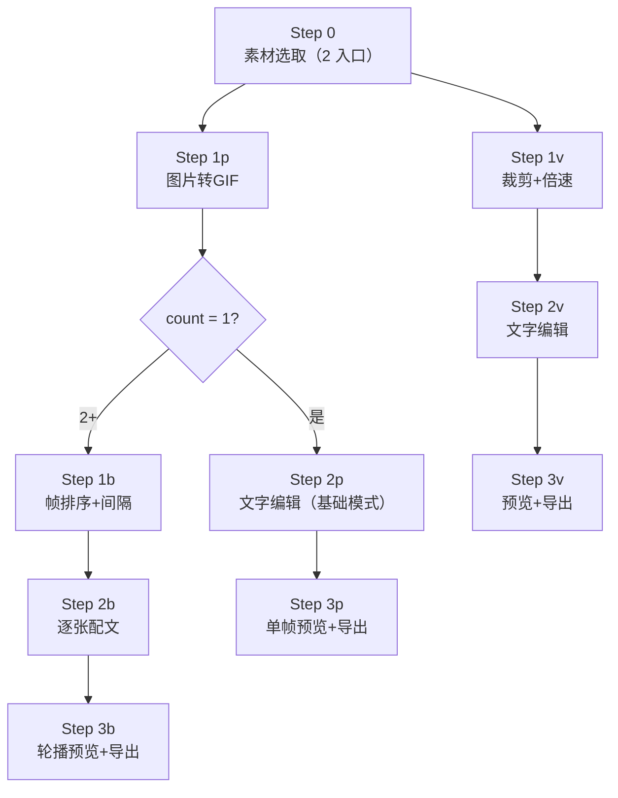
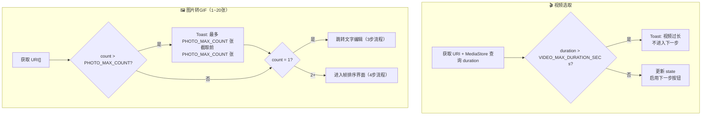
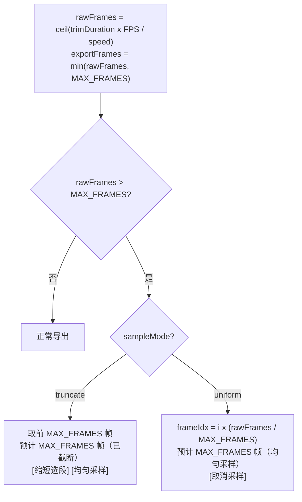
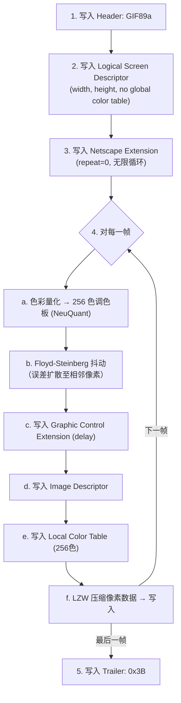

# 表情包制作 APP — 技术设计文档

> 平台：Android + iOS  
> 架构：MVVM + Navigation  
> 参考：Demo 验证版 `demo_unified.html` + 7 个 OpenSpec 变更文档

---

## 一、项目上下文

### 1.1 项目定位

一款轻量级移动端 GIF 表情包制作工具。聚焦核心流程：选素材 → 编辑 → 导出 GIF。用户无需注册、无需联网，离线可用。支持视频转GIF 和图片转GIF 两种入口，图片模式自动适配单张（1帧静图）/多张（多帧动图）。

### 1.2 已验证的 Demo

Demo 版（`demo_unified.html`，约 1700 行 HTML/JS 单文件）已覆盖全部功能逻辑，包括：
- 两入口素材选取（视频 / 图片转GIF 1~20张）
- 倍速、画质、帧数上限、字号、逐张配文
- 帧溢出处理（截断 / 均匀采样）
- 图片自动分支：count=1 → 3 步 / count≥2 → 4 步
- GIF 导出（gif.js Worker 编码，统一输出 GIF）
- 视频预览使用浏览器 `<video>` 元素硬件解码，流畅不卡顿

移动端在此基础上重新实现，适配移动平台特性。其中视频预览硬件解码方案从原设计（`MediaMetadataRetriever` 逐帧提取）改为 `MediaPlayer` + `TextureView` 直接播放，与 demo 的 `<video>` 方案等价。

---

## 二、架构设计

### 2.1 整体架构：MVVM + Navigation



**理由**：MVVM 是 Google (Android) 和 Apple (iOS) 都推荐的架构。ViewModel 持有 UI 状态，跨页面共享，销毁重建时恢复。Domain 层无平台依赖，可被 KMP 共享。`mediaType` 为 `VIDEO` / `PHOTO` 两值，图片模式下通过 `photos.size` 判断单张/多张分支。

**备选方案 MVI**：对于此规模项目过度设计，增加不必要复杂度。

### 2.2 平台语言选型

| 层级 | Android | iOS |
|------|---------|-----|
| UI | Jetpack Compose + Material 3 | SwiftUI |
| ViewModel | `androidx.lifecycle.ViewModel` | `@Observable` class |
| Navigation | Compose Navigation | `NavigationStack` |
| 图片加载 | Coil | AsyncImage / Kingfisher |
| 协程/异步 | Kotlin Coroutines | Swift Concurrency (async/await) |

**跨平台共享（可选）**：Domain 层可用 Kotlin Multiplatform 共享，包含 GIF 编码器、帧计算逻辑、文字渲染算法。UI 层和 ViewModel 各自平台实现。

### 2.3 页面流程



顶部进度指示器随当前步骤变化：
- 视频模式：4 个点 ●○○○
- 图片模式 (count=1)：3 个点 ●○○
- 图片模式 (count≥2)：4 个点 ●○○○

返回键会退到上一步，数据保留。导出中按返回弹出确认对话框。

**布局适配**：根布局使用 `Column` + `statusBarsPadding()` + `navigationBarsPadding()` 避免内容被系统栏遮挡。步骤指示器固定在顶部，内容区 `weight(1f)` 填满剩余空间。裁剪编辑和文字编辑页面使用 `verticalScroll` 支持内容滚动，确保小屏手机也能完整显示所有控件。

### 2.4 缓存策略

> 以下 6 类缓存为设计强制要求，实现时在 `domain/cache/` 下统一管理。

#### ① 视频帧缓存 (`VideoFrameCache`)

| 项 | 说明 |
|----|------|
| 场景 | 用户拖动裁剪滑块、切换倍速、预览片段 — 相同时间戳反复提取 |
| 键 | `(videoUri, timestampSec)` 精确到 `1 / AppConfig.FPS` 秒 |
| 值 | `Bitmap`（Android）/ `CGImage`（iOS），保持原始分辨率 |
| 淘汰 | **LRU，最大 `AppConfig.VIDEO_FRAME_CACHE_MAX` 帧** |
| 失效 | 更换视频 URI 时清空；App 进入后台时缩小至 `AppConfig.VIDEO_FRAME_CACHE_BACKGROUND` 帧 |

```kotlin
class VideoFrameCache(private val maxSize: Int = AppConfig.VIDEO_FRAME_CACHE_MAX) {
    private val cache = LinkedHashMap<String, Bitmap>(maxSize, 0.75f, true)
    fun key(uri: Uri, tSec: Double): String = "${uri}@${"%.3f".format(tSec)}"
    @Synchronized fun get(key: String): Bitmap? = cache[key]
    @Synchronized fun put(key: String, bitmap: Bitmap) {
        if (cache.size >= maxSize) cache.entries.first().let { cache.remove(it.key) }
        cache[key] = bitmap
    }
    fun clear() { cache.clear() }
}
```

#### ② 图片缩略图缓存 (`ThumbnailCache`)

| 项 | 说明 |
|----|------|
| 场景 | 排序界面网格 + 逐张配文导航栏，反复展示同一批照片缩略图 |
| 键 | `(photoUri, thumbnailSize)` |
| 值 | 缩略图 `Bitmap`/`UIImage`（已缩放至目标尺寸） |
| 淘汰 | **LRU，最大 `AppConfig.THUMBNAIL_CACHE_MAX` 张** |
| 预加载 | 进入排序界面时，后台协程提前解码所有照片缩略图 |

实现：复用平台图片加载库（Coil / Kingfisher）自带的内存+磁盘缓存。

#### ③ 字体度量缓存 (`FontMetricsCache`)

| 项 | 说明 |
|----|------|
| 场景 | GIF 导出时逐帧渲染文字，同一段文字/字体/字号被重复测量 |
| 键 | `(text, fontName, fontSize)` |
| 值 | `(width: Float, height: Float)` 文本包围盒 |
| 淘汰 | 导出完成后清空 |

#### ④ 轮播预渲染 (`BurstPreRenderer`)

| 项 | 说明 |
|----|------|
| 场景 | 图片 count≥2 时预览页自动循环轮播 |
| 时机 | 进入预览页面时，后台协程一次性渲染所有帧 |
| 产出 | `List<Bitmap>`/`[CGImage]`，每帧已合成文字 |
| 内存 | ≤ `AppConfig.PHOTO_MAX_COUNT` 帧 × 480×270×4B ≈ **10MB** |

#### ⑤ 导出结果缓存 (`ExportCache`)

| 项 | 说明 |
|----|------|
| 场景 | 用户导出后返回修改一个字 → 再次导出，其他参数完全不变 |
| 键 | `MD5(mediaType + URIs join + trimStart + trimEnd + speed + quality + textJson)` |
| 值 | `ByteArray`/`Data` — 最终 GIF 字节 |
| 淘汰 | App 冷启动清空；最大保留最近 **`AppConfig.EXPORT_CACHE_MAX_ENTRIES` 次**导出结果 |
| 命中提示 | Toast "使用上次导出结果（已跳过编码）" |

```kotlin
object ExportCache {
    private val maxEntries = AppConfig.EXPORT_CACHE_MAX_ENTRIES
    private val cache = LinkedHashMap<String, ByteArray>(maxEntries, 0.75f, true)
    fun cacheKey(vararg parts: Any): String = parts.joinToString("|") { it.toString() }.md5()
    @Synchronized fun get(key: String): ByteArray? = cache[key]
    @Synchronized fun put(key: String, data: ByteArray) {
        if (cache.size >= maxEntries) cache.entries.first().let { cache.remove(it.key) }
        cache[key] = data
    }
}
```

#### ⑥ 文字预览分离缓存 (`TextPreviewCache`)

| 项 | 说明 |
|----|------|
| 场景 | 文字编辑页拖动文字位置/改字号时，预览帧不变，仅文字层变化 |
| 策略 | 缓存当前「原始帧」（不含文字），文字层用 Compose/SwiftUI overlay 实时渲染 |
| 失效 | 返回裁剪页修改裁剪/倍速后，重新截取原始帧 |

#### 缓存生命周期总览

| 缓存 | 初始化 | 清空时机 | 后台行为 |
|------|--------|---------|---------|
| ① 视频帧 | 选取视频后 | 换视频 / App 进程被杀 | 缩减至 `{VIDEO_FRAME_CACHE_BACKGROUND}` 帧 |
| ② 缩略图 | 进入排序界面 | 退出图片流程 | 依赖 Kingfisher/Coil |
| ③ 字体度量 | 导出开始时 | 导出完成 | 不保留 |
| ④ 轮播预渲染 | 进入预览页面 | 退出预览页 / 修改文字 | 不保留 |
| ⑤ 导出结果 | 首次导出后 | 冷启动 / 手动清理 | 不保留（安全性） |
| ⑥ 文字预览 | 进入文字编辑页 | 修改裁剪/倍速 | 保留 |

---

## 三、素材选取

### 3.1 平台实现

| 平台 | 方案 | 权限 |
|------|------|------|
| Android API 33+ | `PickVisualMedia` (PhotoPicker) | 无需权限 |
| Android API 29-32 | `Intent(ACTION_PICK)` + `READ_EXTERNAL_STORAGE` | 需声明权限，运行时请求 |
| iOS 14+ | `PHPickerViewController` | 无需权限 |
| iOS 13 | `UIImagePickerController` | 需 `Info.plist` 声明 |

### 3.2 限制逻辑



### 3.3 URI 持久化

选取的照片/视频 URI 通过 `contentResolver.takePersistableUriPermission()` 获得持久访问权限，确保 App 重启后仍可读取。

---

## 四、视频处理

> **限制**：视频总长 ≤ `AppConfig.VIDEO_MAX_DURATION_SEC` 秒，裁剪选段 ≤ `AppConfig.TRIM_MAX_DURATION_SEC` 秒（由双滑块时间轴约束）。

### 4.1 帧提取（倍速公式）

帧时间公式：`t = trimStart + i × speed / AppConfig.FPS`

| 倍速 | 公式 | `{TRIM_MAX_DURATION_SEC}`s 片段帧数 | GIF 时长 |
|------|------|------------|---------|
| 2x | `t = start + i × 2/FPS` | 40 | 5s |
| 1.5x | `t = start + i × 1.5/FPS` | 54 | 6.75s |
| 1x | `t = start + i/FPS` | 80→`{MAX_FRAMES}` | 7.5s |
| 0.5x | `t = start + i × 0.5/FPS` | 160→`{MAX_FRAMES}` | 7.5s |
| 0.25x | `t = start + i × 0.25/FPS` | 320→`{MAX_FRAMES}` | 7.5s |

### 4.2 平台实现

**Android — MediaMetadataRetriever**

```kotlin
val retriever = MediaMetadataRetriever()
retriever.setDataSource(context, videoUri)
val frameCache = VideoFrameCache()

for (i in 0 until totalFrames) {
    val t = trimStart + i * speed / AppConfig.FPS.toDouble()
    val key = frameCache.key(videoUri, t)
    var frame = frameCache.get(key)
    if (frame == null) {
        val timeUs = (t * 1_000_000).toLong()
        frame = retriever.getFrameAtTime(timeUs, OPTION_CLOSEST)
        frameCache.put(key, frame)
    }
}
retriever.release()
```

**iOS — AVAssetImageGenerator**

```swift
let asset = AVAsset(url: videoURL)
let generator = AVAssetImageGenerator(asset: asset)
generator.requestedTimeToleranceBefore = .zero
generator.requestedTimeToleranceAfter = CMTime(value: 1, timescale: Int32(AppConfig.fps))
let frameCache = await VideoFrameCache()

for i in 0..<totalFrames {
    let t = trimStart + Double(i) * speed / Double(AppConfig.fps)
    let key = await frameCache.key(uri: videoURL, tSec: t)
    var cgImage = await frameCache.get(key)
    if cgImage == nil {
        let cmTime = CMTime(seconds: t, preferredTimescale: 600)
        cgImage = try await generator.image(at: cmTime).image
        if let img = cgImage { await frameCache.put(key, img) }
    }
}
```

### 4.3 帧数溢出处理



### 4.4 视频预览方案（重要设计变更）

> **决定**：裁剪页面的视频预览使用 `MediaPlayer` + `TextureView` 硬件解码，不再使用 `MediaMetadataRetriever` 逐帧提取。

**原因**：`MediaMetadataRetriever.getFrameAtTime()` 每次调用包含 seek + 解码操作，耗时 50–200ms/帧。按 8fps 预览需要 125ms 间隔内完成提取，手机硬件无法稳定达到。而 `MediaPlayer` 利用 GPU 硬件解码管线，与系统相册播放体验一致。这也与 demo 的 `<video>` 元素方案等价。

**实现**：

```kotlin
// AndroidView 嵌入 TextureView，MediaPlayer 绑定到 Surface
AndroidView(factory = { context ->
    TextureView(context).also { tv ->
        tv.surfaceTextureListener = object : TextureView.SurfaceTextureListener {
            override fun onSurfaceTextureAvailable(st: SurfaceTexture, w: Int, h: Int) {
                val player = MediaPlayer().apply {
                    setDataSource(context, videoUri)
                    setSurface(Surface(st))
                    setOnPreparedListener {
                        val pb = PlaybackParams()
                        pb.speed = state.speed  // 原生变速
                        setPlaybackParams(pb)
                        seekTo((state.trimStartSec * 1000).toInt())
                        start()
                    }
                    setOnCompletionListener {
                        // 循环播放选段
                        seekTo((state.trimStartSec * 1000).toInt())
                        start()
                    }
                    prepareAsync()
                }
            }
            override fun onSurfaceTextureDestroyed(st: SurfaceTexture): Boolean {
                mp?.release(); mp = null; return true
            }
            // ...
        }
    }
})
```

**预览区宽高比**：使用视频真实宽高比 `videoAspect = width / height`，而非固定正方形。通过 `MediaMetadataRetriever` 提取首帧 Bitmap 尺寸获得比例。

**静态帧**：非预览状态（拖动滑块后）使用 `MediaMetadataRetriever.getFrameAtTime()` 单次提取当前帧并缩放至 480px 宽。

**交互规则**：
- 点击「预览片段」→ MediaPlayer 启动，按钮变为「停止预览」
- 用户拖动滑块、切换倍速 → 自动停止预览（通过 `LaunchedEffect` 监听 trimStart/trimEnd/speed 变化）
- 播放到片段末尾自动循环回开头

**倍速**：`PlaybackParams.speed = state.speed` 实现原生变速播放，与 demo 行为一致。

**对比总结**：

| | 原设计 | 实现（变更后） |
|---|---|---|
| 预览方案 | MediaMetadataRetriever 逐帧提取 | MediaPlayer + TextureView 硬件解码 |
| 倍速 | 软件计算时间戳偏移 | PlaybackParams 原生变速 |
| 帧率控制 | 协程 delay 125ms | MediaPlayer 内部帧率 |
| 宽高比 | aspectRatio(1f) 正方形 | aspectRatio(videoAspect) 视频原始比例 |
| 画面变形 | 16:9 视频被压扁 | 无变形 |
| 卡顿 | 50-200ms/帧，严重掉帧 | 零卡顿，硬件解码 |

---

## 五、GIF 编码

### 5.1 方案选择

| 方案 | Android | iOS | 包体积 | 编码速度 |
|------|---------|-----|--------|---------|
| FFmpeg (mobile-ffmpeg) | ✓ | ✓ | +30MB | 快 |
| 纯 Kotlin/Swift GIF 编码器 | ✓ | ✓ | 0 | 中等 |

**决定**：Android 与 iOS 均采用纯自研 GIF 编码器（Kotlin/Swift，含 NeuQuant + LZW），不依赖 FFmpeg 或平台原生 GIF API。

### 5.2 GIF89a 编码流程



### 5.3 平台实现

**Android**：`class GifEncoder`，参数 `width: Int, height: Int, quality: Int = AppConfig.DEFAULT_QUALITY.gifSample`

**iOS**：`class GifEncoder`，参数 `let width: Int, height: Int, var quality: Int = AppConfig.defaultQuality.gifSample`

> `CGImageDestination` 因 per-frame delay 控制受限，不采用。

### 5.4 抖动（Dithering）

颜色量化将数百万真彩色映射到 256 色调色板，若不进行抖动处理，平滑渐变区域将出现色带（posterization），导致 GIF 画面模糊、细节丢失。

**Floyd-Steinberg 误差扩散**：逐像素量化时计算原始色与调色板色的误差，按权重（7/16 右侧、3/16 左下、5/16 下方、1/16 右下）扩散至尚未处理的相邻像素。

实现要点：
- 使用分离的 R/G/B 通道缓冲（`IntArray`），允许中间值超出 [0, 255] 而不截断
- 仅查色表时 clamp 到 [0, 255]
- 误差计算基于 clamp 后的值（否则负漂移会逐行累积，导致画面底部全黑）

### 5.5 LZW 编码位宽约束（关键）

GIF LZW 编码器从 `initCodeSize + 1`（固定为 9）开始，字典每次填满一个码位后位宽 +1，上限为 **12 bit**。**超过 12 会导致所有后续码字位宽错误，解码器读到乱码，GIF 显示大面积黑屏或无画面。**

正确逻辑：
```kotlin
// ✅ codeSize 在 12 之后不再增长
if (codeSize < BITS) {  // BITS = 12
    codeSize++
}
```

### 5.6 性能预估

| 场景 | 帧数 | 编码时间（Kotlin） | 编码时间（Swift） |
|------|------|-------------------|-------------------|
| 视频 5s @ `{FPS}`fps | 40 | ~5s | ~4s |
| 视频 `{TRIM_MAX_DURATION_SEC}`s @ `{FPS}`fps → 截断 | `{MAX_FRAMES}` | ~8s | ~6s |
| 图片 `{PHOTO_MAX_COUNT}` 张 | `{PHOTO_MAX_COUNT}` | ~2s | ~1.5s |
| 图片 1 张 → 1帧GIF | 1 | ~0.5s | ~0.3s |

所有编码在后台线程（Dispatchers.Default / Task.detached）执行，不阻塞 UI。

---

## 六、文字渲染

### 6.1 预览渲染

**Android** — 文字编辑页面使用 Compose `Text` 组件叠加在预览帧/照片上方，通过 `Modifier.offset` + `detectDragGestures` 实现单指拖拽，`detectTapGestures(onDoubleTap)` 实现双击居中。视频模式下预览帧从 `MediaMetadataRetriever` 提取中间时间点一帧。

**字体映射**（Compose `FontFamily`）：

| 字体标签 | FontFamily | FontWeight | 视觉特征 |
|---------|-----------|------------|---------|
| 黑体 | SansSerif | ExtraBold | 粗黑醒目 |
| 楷体 | Serif | Bold | 衬线楷风 |
| 仿宋 | Serif | Normal | 衬线瘦体 |
| 默认 | Default | Normal | 系统默认 |
| 粗黑搞怪 | SansSerif | Black | 极粗冲击 |
| 手写涂鸦 | Cursive | Bold + Italic | 斜体手写 |
| 萌萌圆体 | SansSerif | Light | 细轻柔和 |
| 圆体 | SansSerif | Medium | 中等圆体 |

> 字体选择器按钮即展示各自字体效果，用户可直观区分。

### 6.2 导出渲染

导出时在每帧 Bitmap/CGImage 上用 Canvas 绘制文字，引用 `FontMetricsCache` 避免重复测量。

### 6.3 文字参数

| 参数 | 范围/默认 | 导出公式 |
|------|----------|---------|
| 内容 | ≤ `AppConfig.TEXT_MAX_LENGTH` 字 | — |
| 字体 | `AppConfig.FONT_LIST` | — |
| 颜色 | `AppConfig.COLOR_PRESETS` | — |
| 字号 | `AppConfig.FONT_SIZE_MIN_PX`～`AppConfig.FONT_SIZE_MAX_PX`px（基准 `AppConfig.BASE_CANVAS_WIDTH_PX`px 画布） | `exportSize = textSize × (outputWidth / AppConfig.BASE_CANVAS_WIDTH_PX)` |
| 位置 | (0.0~1.0, 0.0~1.0)，默认 (0.5, 0.5) | `exportX = textX × outputWidth` |

---

## 七、图片转GIF 模式

### 7.1 状态模型

```kotlin
// SharedViewModel — 图片相关字段
val photos: List<Uri>                  // 1~{PHOTO_MAX_COUNT} 张
val photoTexts: List<PhotoText?>       // 稀疏数组，索引对应照片
var frameDelay: Int = AppConfig.FRAME_DELAY_DEFAULT_MS  // 帧间隔（count=1 时隐藏控件）
var currentPhotoIdx: Int = 0           // 逐张配文时当前照片索引

// 派生属性
val isSinglePhoto: Boolean get() = photos.size == 1
```

### 7.2 文字编辑（自适应）

**count=1（基础模式）**：`renderVideoText()` 样式的文字编辑页（无导航器，无继承规则）。

**count≥2（逐张配文）**：照片导航器 ← N/M → + `getPhotoText(idx)` 继承规则 + `saveCurrentPhotoText()` 独立存储。

```kotlin
fun getPhotoText(idx: Int): PhotoText? {
    if (photoTexts.getOrNull(idx) != null) return photoTexts[idx]
    for (i in idx - 1 downTo 0) {
        if (photoTexts.getOrNull(i) != null) return photoTexts[i]
    }
    return null
}
```

### 7.3 预览

**count=1**：静态预览。

**count≥2**：进入时预渲染全部帧（④ `BurstPreRenderer`），然后 `LaunchedEffect` 循环轮播。

```kotlin
LaunchedEffect(state.photos.size) {
    state.preRenderedFrames = preRenderBurstFrames()
    var idx = 0
    while (isActive) {
        delay(state.frameDelay.toLong())
        idx = (idx + 1) % state.photos.size
        currentPreviewIdx = idx
    }
}
```

### 7.4 导出

统一走 `exportPhotoGIF()`：

- 遍历 `photos` 数组
- 每张照片加载为 Bitmap/UIImage，等比缩放至 `AppConfig.PHOTO_OUTPUT_WIDTH`px
- `getPhotoText(i)` 或 `photoTexts[0]` 获取配文，Canvas 绘制
- count=1：1 帧，`delay = AppConfig.GIF_DELAY_DIVISOR`（单帧静图）
- count≥2：多帧，`delay = frameDelay / AppConfig.GIF_DELAY_DIVISOR`
- 编码前检查 ⑤ 导出结果缓存

---

## 八、画质控制

### 8.1 画质档位

```kotlin
enum class Quality(val width: Int, val gifSample: Int, val label: String) {
    LOW(360, 20, "流畅"),
    MEDIUM(480, 10, "标准"),
    HIGH(640, 3, "高清"),
}
```

`gifSample` 为 NeuQuant 色彩量化采样间隔（`AppConfig.GIF_SAMPLE_MIN`~`AppConfig.GIF_SAMPLE_MAX`）。

### 8.2 可见性

| 模式 | 画质选择器 |
|------|-----------|
| 视频模式 | 显示，`AppConfig.Quality` 三档可选 |
| 图片转GIF | 隐藏，固定 `AppConfig.Quality.MEDIUM`（480px） |

---

## 九、文件 I/O 与权限

### 9.1 保存到系统相册

**Android — MediaStore**：`RELATIVE_PATH = AppConfig.SAVE_DIRECTORY`，MIME `image/gif`

**iOS — PHPhotoLibrary**：`PHAssetCreationRequest.forAsset().addResource(with: .photo, data: gifData)`

### 9.2 存储空间检测

导出前检测可用空间，不足 → 弹窗 "存储空间不足，请清理后重试"。

---

## 九-A、日志系统

> 格式：`[大任务|Task] 描述 | key=value`。大任务 = `视频转GIF` / `图片转GIF` / `System`。

### 实现方式

```kotlin
object EmojiLogger {
    fun info(task: String, subTask: String, msg: String, vararg pairs: Pair<String, Any>) {
        val params = pairs.joinToString(" ") { "${it.first}=${it.second}" }
        Log.i("[$task|$subTask]", "$msg | $params")
    }
    // warn, error 同理
}

// 示例
EmojiLogger.info("视频转GIF", "导出", "导出完成", "size" to "480KB", "frames" to 40)
EmojiLogger.info("图片转GIF", "选取照片", "照片已选取", "count" to 10, "totalSize" to "25.0MB")
EmojiLogger.info("图片转GIF", "帧排序", "排序变更", "fromIdx" to 5, "toIdx" to 2)
```

```swift
extension Logger {
    static let 视频转GIF = Logger(subsystem: "com.emoji.app", category: "视频转GIF")
    static let 图片转GIF = Logger(subsystem: "com.emoji.app", category: "图片转GIF")
    static let system    = Logger(subsystem: "com.emoji.app", category: "System")
}
```

### 日志级别控制

| 构建类型 | Android | iOS |
|---------|---------|-----|
| Debug | INFO 及以上全输出 | INFO 及以上全输出 |
| Release | WARN 及以上（省电+安全） | WARN 及以上 |

> Release 模式下不输出包含文件路径、个人内容的参数。

---

## 十、风险与对策

| 风险 | 概率 | 对策 |
|------|------|------|
| GIF 文件较大（`{MAX_FRAMES}` 帧高清可能 > 2MB） | 中 | 导出后展示文件大小；默认"标准"档 |
| 大视频帧提取阻塞 UI | 高 | 全部处理放后台协程，显示进度 |
| 纯 Kotlin/Swift 编码速度慢 | 中 | `{FPS}`fps 小幅帧率优化 |
| 内存峰值 | 中 | 逐帧即用即弃 + 视频帧 LRU 缓存上限 `AppConfig.VIDEO_FRAME_CACHE_MAX` 帧 |
| iOS CGImageDestination delay 限制 | 高 | 使用自研 Swift GIF 编码器替代 |
| 视频帧缓存命中率低 | 低 | 相同时间戳命中关键；换倍速后首轮全量不可避免 |
| 导出结果缓存误命中 | 低 | 缓存 key 覆盖全部参数，任何变化必 miss |

---

## 十一、关键类/文件结构

### AppConfig（配置参数）

```kotlin
// Android — AppConfig.kt
object AppConfig {
    // 素材限制
    const val VIDEO_MAX_DURATION_SEC = 30
    const val TRIM_MAX_DURATION_SEC = 10
    const val PHOTO_MIN_COUNT = 1
    const val PHOTO_MAX_COUNT = 20
    // 视频帧提取
    const val FPS = 8
    const val MAX_FRAMES = 60
    val SPEED_OPTIONS = listOf(0.25f, 0.5f, 1.0f, 1.5f, 2.0f)
    const val DEFAULT_SPEED = 1.0f
    // 图片帧排序
    const val FRAME_DELAY_MIN_MS = 500
    const val FRAME_DELAY_MAX_MS = 1500
    const val FRAME_DELAY_DEFAULT_MS = 500
    const val THUMBNAIL_SIZE_DP = 72
    // 文字
    const val TEXT_MAX_LENGTH = 50
    const val FONT_SIZE_MIN_PX = 16
    const val FONT_SIZE_MAX_PX = 80
    const val FONT_SIZE_DEFAULT_PX = 36
    const val BASE_CANVAS_WIDTH_PX = 420
    val FONT_LIST = listOf("系统默认","黑体","楷体","仿宋","圆体","粗黑搞怪","手写涂鸦","萌萌圆体")
    val COLOR_PRESETS = listOf(0xFFFFFFFF, 0xFF000000, 0xFFFF0000, 0xFFFFFF00, 0xFF0000FF, 0xFF00FF00)
    const val DEFAULT_FONT = "黑体"
    const val DEFAULT_COLOR = 0xFFFFFFFF
    const val DEFAULT_TEXT_X = 0.5f
    const val DEFAULT_TEXT_Y = 0.5f
    // 画质
    enum class Quality(val width: Int, val gifSample: Int, val label: String) {
        LOW(360, 20, "流畅"), MEDIUM(480, 10, "标准"), HIGH(640, 3, "高清"),
    }
    val DEFAULT_QUALITY = Quality.MEDIUM
    const val GIF_SAMPLE_MIN = 1
    const val GIF_SAMPLE_MAX = 30
    const val PHOTO_OUTPUT_WIDTH = 480
    // 导出
    const val EXPORT_FILENAME_PATTERN = "emoji_yyyyMMdd_HHmmss"
    const val SAVE_DIRECTORY = "Emoji"       // MediaStore RELATIVE_PATH 相对于 DCIM
    const val GIF_DELAY_DIVISOR = 10
    const val GIF_LOOP_COUNT = 0
    const val PHOTO_OUTPUT_WIDTH = 480
    // 性能
    const val EXPORT_TIMEOUT_VIDEO_SEC = 15
    const val EXPORT_TIMEOUT_PHOTO_SEC = 10
    const val MEMORY_PEAK_MB = 200
    // 缓存
    const val VIDEO_FRAME_CACHE_MAX = 100
    const val VIDEO_FRAME_CACHE_BACKGROUND = 20
    const val THUMBNAIL_CACHE_MAX = 60
    const val EXPORT_CACHE_MAX_ENTRIES = 3
}
```

```swift
// iOS — AppConfig.swift (与 Kotlin 版对应，略)
```

### 文件结构

```
app/
├── ui/
│   ├── screens/
│   │   ├── MaterialPickScreen.kt        # 素材选取（2入口 + PhotoPicker）
│   │   ├── VideoTrimScreen.kt           # 裁剪+倍速+预览（MediaPlayer播放）
│   │   ├── TextEditScreen.kt            # 文字编辑（自适应单张/多张/视频）
│   │   ├── PhotoOrderScreen.kt          # 帧排序+间隔（count≥2）
│   │   └── PreviewExportScreen.kt       # 预览+导出
│   ├── components/
│   │   ├── StepIndicator.kt             # 步骤指示器
│   │   ├── SpeedSelector.kt             # 倍速选择器
│   │   ├── FontSelector.kt              # 字体选择器（FlowRow + FontFamily区分）
│   │   ├── ColorSelector.kt             # 颜色选择器
│   │   ├── FontSizeSlider.kt            # 字号滑块
│   │   └── QualitySelector.kt           # 画质选择器
│   └── theme/
│       └── Theme.kt                     # 暗色主题（#1a1a2e/#7c4dff）
├── viewmodel/
│   └── SharedViewModel.kt               # 集中状态管理（StateFlow）
├── domain/
│   ├── AppConfig.kt                     # 全局配置常量
│   ├── GifEncoder.kt                    # GIF89a 编码器
│   ├── NeuQuant.kt                      # 神经网络色彩量化
│   ├── LZWEncoder.kt                    # LZW 压缩
│   ├── FrameExtractor.kt               # 视频帧提取（导出用）
│   ├── TextRenderer.kt                  # 帧上文字渲染
│   ├── ExportEngine.kt                  # 导出流程编排
│   ├── Logger.kt                        # 结构化日志
│   ├── model/
│   │   └── Model.kt                     # MediaType, PhotoText, SampleMode
│   └── cache/
│       ├── VideoFrameCache.kt           # ① LRU 视频帧缓存
│       ├── ThumbnailCache.kt            # ② LRU 缩略图缓存
│       ├── FontMetricsCache.kt          # ③ 字体度量缓存
│       └── ExportCache.kt              # ⑤ MD5 导出结果缓存
└── data/
    ├── MediaRepository.kt               # MediaStore 保存 GIF
    └── PermissionHelper.kt              # 权限处理
```

---

> 参考文档：
> - `openspec/APP_REQUIREMENTS.md` — 移动端需求文档
> - `openspec/changes/unify-photo-burst-gif/` — 合并变更
