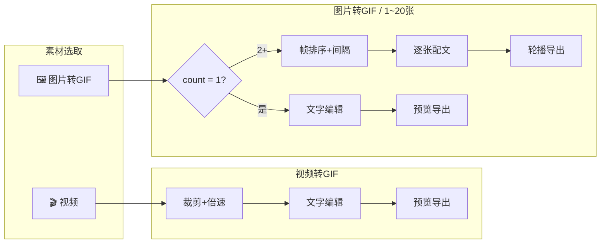
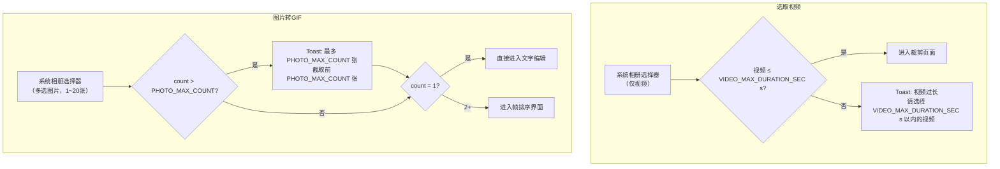
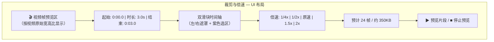
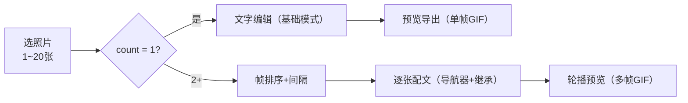
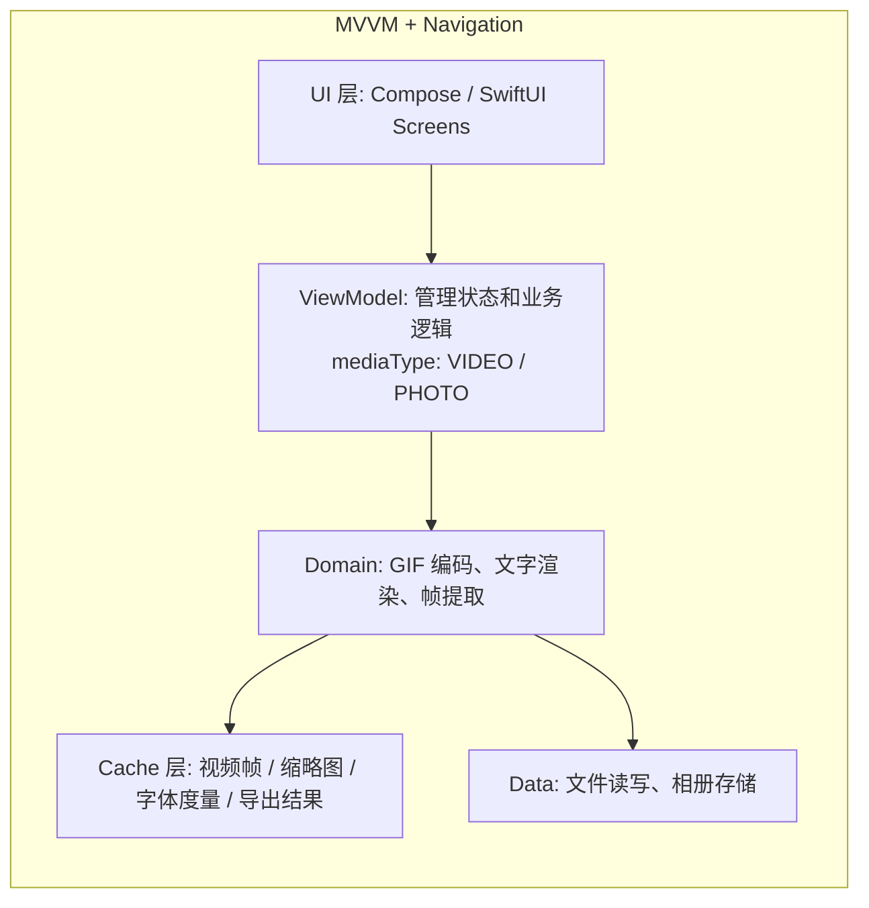

# 表情包制作 APP — 移动端需求文档

> 平台：Android + iOS  
> 技术栈：[待定]  
> 版本：v1.0  
> 基于：Demo 验证版（`demo_unified.html`）+ OpenSpec 变更文档

---

## 一、产品概述

一款跨平台手机 APP，让用户在 30 秒内完成表情包 GIF 制作。核心流程：选素材 → 编辑 → 导出。支持视频和图片两种素材来源，图片模式自动适配单张/多张流程，提供倍速、画质、字号、逐张配文等精细化控制。

### 使用场景

- 从相册选一段视频，截取精彩 3-5 秒，加上吐槽文字做成表情包
- 用一张照片加一行文案，导出 1 帧 GIF（静图），聊天中与 PNG 体验一致
- 把 10 张连拍照合成 GIF，每张配不同文字，生成剧情向表情包

---

## 二、功能架构



> 两种素材来源，图片模式自动按数量分支。

---

## 三、素材选取（共 2 个入口）

| 入口 | 文件类型 | 限制 | 后续流程 |
|------|---------|------|---------|
| 🎬 选取视频 | MP4/MOV/3GP | 最长 `{VIDEO_MAX_DURATION_SEC}` 秒 | → 裁剪 → 文字 → 导出 |
| 🖼 图片转GIF | JPG/PNG/HEIC 多选 | `{PHOTO_MIN_COUNT}`–`{PHOTO_MAX_COUNT}` 张 | count=1 → 文字 → 导出<br/>count≥2 → 排序 → 逐张配文 → 导出 |

### 权限处理

| 平台 | 方案 |
|------|------|
| Android | API 33+ `PhotoPicker`（无权限）、API 29-32 `READ_EXTERNAL_STORAGE` |
| iOS | `PHPickerViewController`（无需权限，iOS 14+） |

### 交互规格



---

## 四、视频转GIF

### 流程


步骤数：4 步

### 4.1 裁剪与倍速

| 参数 | 值 |
|------|-----|
| 选段上限 | `{TRIM_MAX_DURATION_SEC}` 秒 |
| 倍速选项 | 由 `{SPEED_OPTIONS}` 生成 |
| 默认倍速 | `{DEFAULT_SPEED}`x |
| 帧率 | `{FPS}`fps |
| 最大帧数 | `{MAX_FRAMES}` 帧 |

**UI 布局**：


**预览机制**：裁剪页面使用 `MediaPlayer` + `TextureView` 硬件解码直接播放选段，支持 `PlaybackParams.speed` 原生变速，保持与系统相册相同的流畅度。用户拖动滑块或切换倍速时自动停止预览，再点击按钮重新开始。静态帧仅用于非播放状态，通过 `MediaMetadataRetriever.getFrameAtTime()` 单次提取。

**帧提取公式**（导出用）：`t = trimStart + i × speed / {FPS}`

| 倍速 | `{TRIM_MAX_DURATION_SEC}`s 选段帧数 | GIF 时长 | 效果 |
|------|------------|---------|------|
| 2x | 40 | 5s | 加速 |
| 1.5x | 54 | 6.75s | 快放 |
| 1x | 80→`{MAX_FRAMES}`截断 | 7.5s | 原速 |
| 0.5x | 160→`{MAX_FRAMES}`截断 | 7.5s | 慢放 |
| 0.25x | 320→`{MAX_FRAMES}`截断 | 7.5s | 极慢 |

> 具体帧数由 `{FPS}`、`{MAX_FRAMES}`、`{SPEED_OPTIONS}`、`{TRIM_MAX_DURATION_SEC}` 共同决定。

### 4.2 文字编辑

| 控件 | 范围/选项 | 默认值 |
|------|----------|--------|
| 文字内容 | 最多 `{TEXT_MAX_LENGTH}` 字 | 空 |
| 字体 | `{FONT_LIST}`（≥6 种） | `{DEFAULT_FONT}` |
| 颜色 | `{COLOR_PRESETS}`（6 色预设） | `{DEFAULT_COLOR}` |
| 字号 | 滑块 `{FONT_SIZE_MIN_PX}`px ~ `{FONT_SIZE_MAX_PX}`px（基准 `{BASE_CANVAS_WIDTH_PX}`px 画布） | `{FONT_SIZE_DEFAULT_PX}`px |
| 位置 | 单指拖拽 + 双击居中 | 画面中央 |

**导出字号缩放**：`exportSize = textSize × (outputWidth / {BASE_CANVAS_WIDTH_PX})`

### 4.3 预览与导出

**画质档位**：
| 档位 | 输出宽度 | 预估 `{MAX_FRAMES}` 帧 | 场景 |
|------|---------|-----------|------|
| 流畅 | `{QUALITY_PRESETS.LOW.width}`px | ~250KB | 聊天快速发送 |
| 标准 | `{QUALITY_PRESETS.MEDIUM.width}`px | ~500KB | 日常表情 |
| 高清 | `{QUALITY_PRESETS.HIGH.width}`px | ~700KB | 收藏分享 |

**导出流程**：
1. 视频帧提取（`{FPS}`fps，按倍速偏移）
2. Canvas 逐帧渲染文字
3. GIF 编码（LZW + GIF89a）
4. 保存到系统相册

**异常处理**：
- 导出超时 → 提示具体原因，允许重试
- 存储空间不足 → 提前检测并提示
- 导出中退出 → 确认对话框，清理临时文件

---

## 五、图片转GIF

### 流程



| count | 步骤数 | 流程 |
|-------|--------|------|
| = 1 | 3 步 | 选取 → 文字编辑 → 预览导出（1帧GIF） |
| ≥ 2 | 4 步 | 选取 → 帧排序+间隔 → 逐张配文 → 轮播导出 |

### 5.1 帧排序（count ≥ 2）

| 功能 | 说明 |
|------|------|
| 缩略图列表 | 网格布局，每张 `{THUMBNAIL_SIZE_DP}`×`{THUMBNAIL_SIZE_DP}`dp |
| 拖拽排序 | 长按 → 拖到新位置 → 松手 |
| 删除 | 缩略图右上角 × 按钮 |
| 添加更多 | 追加选取，总数 ≤ `{PHOTO_MAX_COUNT}` |
| 帧间隔 | 滑块 `{FRAME_DELAY_MIN_MS}`ms ~ `{FRAME_DELAY_MAX_MS}`ms，默认 `{FRAME_DELAY_DEFAULT_MS}`ms |
| 预估 | 实时显示：XX 帧 / X.Xs / 约 XXKB |

### 5.2 文字编辑（自适应）

| count=1 | count≥2 |
|---------|---------|
| 预览图 + 文字叠加层 | 照片导航器（← N/M →）+ 逐张配文 |
| 无导航器，无继承规则 | 继承规则：向前查找最近有配文的 |
| 文字控件全量（见 §4.2） | 文字控件全量（与 count=1 共用同一套控件） |

### 5.3 预览

| count=1 | count≥2 |
|---------|---------|
| 单帧静态预览 | 自动循环轮播（间隔 = frameDelay） |
| — | 文字随照片联动切换 |

### 5.4 导出

- 输出：**GIF（GIF89a）**。1 张时输出 1 帧 GIF（聊天中显示为静图，与 PNG 体验一致）
- 画质：固定 `{PHOTO_OUTPUT_WIDTH}`px（无画质选择器）
- count=1：`delay = {GIF_DELAY_DIVISOR}`（单帧表现）
- count≥2：`delay = frameDelay / {GIF_DELAY_DIVISOR}`
- 每帧使用各自 `photoTexts[i]` 独立渲染

> PNG 导出已移除。统一走 GIF，简化导出管线。

---

## 六、全局参数

### 导出通用规格

| 参数 | 视频转GIF | 图片转GIF |
|------|----------|----------|
| 格式 | GIF89a | GIF89a |
| 最大宽度 | `{QUALITY_PRESETS.HIGH.width}`px（三档可选） | `{PHOTO_OUTPUT_WIDTH}`px |
| 色彩 | 256 色调色板（NeuQuant 量化 + Floyd-Steinberg 抖动） | 256 色调色板（NeuQuant 量化 + Floyd-Steinberg 抖动） |
| 音频 | 无 | 无 |
| 文件大小 | 200KB ~ 2MB | 50KB ~ 2MB |

> **抖动**：Floyd-Steinberg 误差扩散算法将量化误差按权重（7/16, 3/16, 5/16, 1/16）分散至相邻像素，消除色带，保留平滑渐变和细节。实现时使用分离的 R/G/B 通道缓冲，仅在查色表时 clamp，误差基于 clamp 后的值计算以避免负漂移。
>
> **LZW 位宽约束**：编码位宽从 9 bit 起始，最大 12 bit。超过 12 会导致比特流错位，GIF 解码出大面积黑屏。实现必须在位宽到达上限后停止增长。

### 交付格式

- 输出文件命名：`{EXPORT_FILENAME_PATTERN}.gif`
- 保存路径：系统相册 `DCIM/{SAVE_DIRECTORY}/`（Android 为 `DCIM/Emoji/`）

---

## 七、技术方案（建议）

### 平台语言

| 平台 | 语言/框架 | UI 框架 |
|------|----------|--------|
| Android | Kotlin 2.0+ | Jetpack Compose + Material 3 |
| iOS | Swift 5.9+ | SwiftUI |

> 可选跨平台方案：**Kotlin Multiplatform (KMP) + Compose Multiplatform** 共享业务逻辑，UI 层各自实现。

### 核心依赖

| 模块 | Android | iOS |
|------|---------|-----|
| 视频帧提取（导出） | MediaMetadataRetriever | AVAssetImageGenerator |
| 视频预览（播放） | MediaPlayer + TextureView | AVPlayer + UIViewRepresentable |
| GIF 编码 | 纯 Kotlin/Swift GIF 编码器（LZW+NeuQuant） | 同左 |
| 图片加载 | Coil | Kingfisher / AsyncImage |
| 权限 | PhotoPicker (33+), READ_EXTERNAL_STORAGE (29-32) | PHPicker, Photos framework |

### 架构



> `mediaType` 枚举：`VIDEO` / `PHOTO`（已移除 `BURST`）。图片模式下通过 `photos.size` 判断单张/多张分支。  
> 缓存策略详见 `APP_DESIGN.md` §2.4。关键缓存 6 项。

### 性能要求

| 指标 | 目标 |
|------|------|
| 视频 `{TRIM_MAX_DURATION_SEC}`s@`{QUALITY_PRESETS.MEDIUM.width}`p GIF 导出 | < `{EXPORT_TIMEOUT_VIDEO_SEC}` 秒 |
| 图片 `{PHOTO_MAX_COUNT}` 张 GIF 导出 | < `{EXPORT_TIMEOUT_PHOTO_SEC}` 秒 |
| 内存占用峰值 | < `{MEMORY_PEAK_MB}`MB |
| 包体积 | < 20MB（不含 FFmpeg） |

---

## 八、需求能力清单

### 素材与导航
- `SELECT-01` 从相册选取视频（≤`{VIDEO_MAX_DURATION_SEC}`s）
- `SELECT-02` 从相册选取照片（1~`{PHOTO_MAX_COUNT}`张，自动适配单张/多张流程）
- `NAV-01` 4 步/3 步向导式流程，顶部进度指示器
- `NAV-02` 步骤间前进/后退，数据保留
- `NAV-03` 导出中按返回弹出确认对话框

### 视频处理
- `TRIM-01` 双滑块时间轴选择起止时间（≤`{TRIM_MAX_DURATION_SEC}`s）
- `TRIM-02` 时间轴缩略图预览条
- `TRIM-03` 选中片段循环预览
- `SPEED-01` `{SPEED_OPTIONS.length}` 档倍速选择（由 `{SPEED_OPTIONS}` 定义）
- `SPEED-02` 倍速联动帧数/文件大小预估
- `SPEED-03` 帧数溢出 → 缩短选段 / 均匀采样

### 文字编辑
- `TEXT-01` 文字输入（≤`{TEXT_MAX_LENGTH}` 字）
- `TEXT-02` 字体选择（`{FONT_LIST}`）
- `TEXT-03` 颜色选择（`{COLOR_PRESETS}`）
- `TEXT-04` 字号滑块（`{FONT_SIZE_MIN_PX}`–`{FONT_SIZE_MAX_PX}`px）
- `TEXT-05` 单指拖拽定位 + 双击居中
- `TEXT-06` 图片模式自适应：count=1 基础编辑 / count≥2 逐张配文 + 继承规则

### 导出
- `EXPORT-01` 视频 → GIF 导出（三档画质）
- `EXPORT-02` 图片 → GIF 导出（固定 `{PHOTO_OUTPUT_WIDTH}`px，1帧=静图 / 多帧=动图）
- `EXPORT-03` 导出进度 + 取消
- `EXPORT-04` 保存到系统相册（`{SAVE_DIRECTORY}`）
- `EXPORT-05` 存储空间不足检测
- `EXPORT-06` 导出超时处理

### 系统
- `SYS-01` 相册权限请求
- `SYS-02` 跨页面状态保持
- `SYS-03` 深色/浅色主题
- `SYS-04` 无网络离线可用
- `SYS-05` 结构化日志系统（格式 `[大任务|Task]`，大任务 = 视频转GIF / 图片转GIF / System）
- `SYS-06` 6 项缓存策略（视频帧 LRU / 缩略图 / 字体度量 / 轮播预渲染 / 导出结果复用 / 文字预览分离）

---

## 九、日志系统

为快速定位 Bug 和分析用户行为，所有业务操作记录结构化日志。日志分两级：**大任务** 对应 2 条主流程（视频转GIF / 图片转GIF）+ System；**Task** 对应每个大任务下的具体开发 Task（参见 `TASKS.md`）。

### 9.1 日志层级

```
[大任务|Task] 描述 | key=value

大任务：  视频转GIF | 图片转GIF | System
Task：   每个大任务下对应的 Task 名称（如 选取视频、裁剪倍速、导出……）
```

### 9.2 日志定义

#### 图片转GIF（照片 → GIF）

| Task | 触发时机 | 参数 |
|------|---------|------|
| `选取照片` | 用户选取照片（1~20张） | count, totalSize, mimeType |
| `帧排序` | 拖拽排序 / 删除 / 追加（仅 count≥2） | fromIdx, toIdx / deletedIdx / addedCount |
| `帧排序` | 帧间隔变更（仅 count≥2） | fromDelay, toDelay |
| `文字编辑` | 文字内容/字体/颜色/字号/位置变更 | length, fontChanged, colorChanged, fromSize, toSize |
| `逐张配文` | 逐张配文变更 + 导航切换（仅 count≥2） | photoIdx, contentLength, fromIdx, toIdx |
| `导出` | 开始导出 | photoCount, frameDelay, quality (GIF) |
| `导出` | 逐帧合成进度 | progress (N/total) |
| `导出` | GIF 编码 | progress (0-100%) |
| `导出` | 导出完成 | fileSize, duration, totalFrames, format (GIF) |
| `导出` | 导出失败 | errorMessage, photoIdx |

#### 视频转GIF（视频 → GIF）

| Task | 触发时机 | 参数 |
|------|---------|------|
| `选取视频` | 用户选取视频 | duration, size, mimeType |
| `选取视频` | 视频时长校验 | duration, result (pass/reject) |
| `裁剪倍速` | 裁剪起止点变更 | trimStart, trimEnd, duration |
| `裁剪倍速` | 倍速切换 | fromSpeed, toSpeed |
| `裁剪倍速` | 帧数溢出处理 | rawFrames, mode (truncate/uniform) |
| `裁剪倍速` | 预览片段播放 | trimStart, trimEnd, speed |
| `导出` | 开始导出 | trimStart, trimEnd, speed, quality, estimatedFrames |
| `导出` | 逐帧提取进度 | progress (N/total), timestamp |
| `导出` | GIF 编码 | progress (0-100%) |
| `导出` | 导出完成 | fileSize, duration, totalFrames |
| `导出` | 导出失败 | errorMessage, errorCode, step (extract/encode) |

#### System（系统级）

| 二级 Tag | 触发时机 | 参数 |
|----------|---------|------|
| `Permission` | 权限请求 | permission, result (granted/denied) |
| `StorageCheck` | 存储空间检测 | availableMB, requiredMB |
| `AppColdStart` | 冷启动 | appVersion, platform (Android/iOS), deviceModel |
| `AppLifecycle` | 前后台切换 | event (foreground/background) |
| `Crash` | 未捕获异常 | stackTrace, lastScreen, lastAction |

### 9.3 日志格式

```
[大任务|Task] 描述 | key=value key=value
```

示例：
```
[视频转GIF|选取视频] 视频已选取 | duration=15.3s size=12.3MB mime=video/mp4
[视频转GIF|裁剪倍速] 倍速切换 | from=1x to=2x frames=40→20
[视频转GIF|导出] 导出完成 | size=480KB duration=4.2s frames=40 quality=medium

[图片转GIF|选取照片] 照片已选取 | count=10 totalSize=25.0MB
[图片转GIF|帧排序] 排序变更 | fromIdx=5 toIdx=2
[图片转GIF|逐张配文] 配文更新 | photoIdx=3 contentLen=3
[图片转GIF|导出] 导出完成 | size=600KB duration=5.0s frames=10 format=GIF

[System|Permission] 权限请求 | type=READ_STORAGE result=GRANTED
```

### 9.4 平台实现

| 平台 | 框架 | 特性 |
|------|------|------|
| Android | Timber / `android.util.Log` | TAG = `[大任务\|Task]`，支持 Debug/Release 分级 |
| iOS | `os.Logger` (iOS 14+) | subsystem: `com.emoji.app`，category = 大任务（`视频转GIF` / `图片转GIF` / `System`） |

### 9.5 日志级别

| 级别 | 用途 | 示例 |
|------|------|------|
| INFO | 正常业务流程 | 选取视频、裁剪、导出完成 |
| WARN | 降级/截断 | 帧数溢出截断、存储空间偏低 |
| ERROR | 异常/失败 | 导出失败、帧提取超时、权限被拒 |

---

## 十、配置参数 (AppConfig)

> 以下所有可调参数集中定义，不散落在业务代码中。实现时读取单一配置源（如 `AppConfig.kt` / `AppConfig.swift`），方便后续调整。

### 素材限制

| 配置键 | 默认值 | 说明 |
|--------|--------|------|
| `VIDEO_MAX_DURATION_SEC` | `30` | 视频最大时长（秒） |
| `TRIM_MAX_DURATION_SEC` | `10` | 裁剪选段最大时长（秒） |
| `PHOTO_MIN_COUNT` | `1` | 图片最少张数 |
| `PHOTO_MAX_COUNT` | `20` | 图片最多张数 |

### 视频帧提取

| 配置键 | 默认值 | 说明 |
|--------|--------|------|
| `FPS` | `8` | 帧提取帧率（fps） |
| `MAX_FRAMES` | `60` | 导出最大帧数 |
| `SPEED_OPTIONS` | `[0.25, 0.5, 1.0, 1.5, 2.0]` | 倍速档位 |
| `DEFAULT_SPEED` | `1.0` | 默认倍速 |

### 图片帧排序

| 配置键 | 默认值 | 说明 |
|--------|--------|------|
| `FRAME_DELAY_MIN_MS` | `500` | 帧间隔最小值（ms） |
| `FRAME_DELAY_MAX_MS` | `1500` | 帧间隔最大值（ms） |
| `FRAME_DELAY_DEFAULT_MS` | `500` | 帧间隔默认值（ms） |
| `THUMBNAIL_SIZE_DP` | `72` | 缩略图尺寸（dp/pt） |

### 文字

| 配置键 | 默认值 | 说明 |
|--------|--------|------|
| `TEXT_MAX_LENGTH` | `50` | 文字最大字数 |
| `FONT_SIZE_MIN_PX` | `16` | 字号下限（px，基准画布） |
| `FONT_SIZE_MAX_PX` | `80` | 字号上限（px，基准画布） |
| `FONT_SIZE_DEFAULT_PX` | `36` | 默认字号（px，基准画布） |
| `BASE_CANVAS_WIDTH_PX` | `420` | 字号基准画布宽度（px） |
| `FONT_LIST` | `["系统默认","黑体","楷体","仿宋","圆体","粗黑搞怪","手写涂鸦","萌萌圆体"]` | 可选字体列表 |
| `COLOR_PRESETS` | `[白,黑,红,黄,蓝,绿]` | 6 色预设 |
| `DEFAULT_FONT` | `"黑体"` | 默认字体 |
| `DEFAULT_COLOR` | `"白色"` | 默认颜色 |
| `DEFAULT_TEXT_X` | `0.5` | 默认文字 X 位置（比例） |
| `DEFAULT_TEXT_Y` | `0.5` | 默认文字 Y 位置（比例） |

### 画质

| 配置键 | 默认值 | 说明 |
|--------|--------|------|
| `QUALITY_PRESETS` | `{LOW: {width:360, sample:20}, MEDIUM: {width:480, sample:10}, HIGH: {width:640, sample:3}}` | 画质三档（视频模式显示选择器） |
| `DEFAULT_QUALITY` | `MEDIUM` | 默认画质档位 |
| `PHOTO_OUTPUT_WIDTH` | `480` | 图片转GIF 固定输出宽度（px） |

### 导出

| 配置键 | 默认值 | 说明 |
|--------|--------|------|
| `EXPORT_FILENAME_PATTERN` | `"emoji_yyyyMMdd_HHmmss"` | 输出文件名模板 |
| `SAVE_DIRECTORY` | `"DCIM/Emoji"` | 系统相册保存目录 |
| `GIF_DELAY_DIVISOR` | `10` | GIF delay 除数（delayMs / DIVISOR = GIF 帧间延迟单位 1/100s） |
| `GIF_LOOP_COUNT` | `0` | GIF 循环次数（0 = 无限） |
| `SAVE_DIRECTORY` | `"Emoji"` | MediaStore 保存子目录（相对于 DCIM） |

### 性能目标

| 配置键 | 默认值 | 说明 |
|--------|--------|------|
| `EXPORT_TIMEOUT_VIDEO_SEC` | `15` | 视频 GIF 导出超时（秒） |
| `EXPORT_TIMEOUT_PHOTO_SEC` | `10` | 图片 GIF 导出超时（秒） |
| `MEMORY_PEAK_MB` | `200` | 内存占用峰值上限（MB） |

### 缓存

| 配置键 | 默认值 | 说明 |
|--------|--------|------|
| `VIDEO_FRAME_CACHE_MAX` | `100` | ① 视频帧 LRU 缓存上限（帧数） |
| `VIDEO_FRAME_CACHE_BACKGROUND` | `20` | App 进入后台时视频帧缓存缩减至 |
| `THUMBNAIL_CACHE_MAX` | `60` | ② 缩略图缓存上限（张数） |
| `EXPORT_CACHE_MAX_ENTRIES` | `3` | ⑤ 导出结果缓存保留最近导出次数 |

> 注：正文中所有数值默认取自本表。如需调整限制，仅需修改对应配置键，无需改动业务逻辑。

---

## 十一、待扩展（Backlog）

| 优先级 | 功能 | 说明 |
|--------|------|------|
| P1 | 历史记录 | 最近 5 个 GIF，可重新下载/分享（v2） |
| P2 | 文字描边 | 文字外描边提升可读性 |
| P2 | 一键分享 | 导出后直接分享到微信/QQ/Instagram |
| P3 | 滤镜 | 3-5 种基础滤镜 |
| P3 | 贴纸 | 预置表情贴纸，拖拽放置 |

---

> 参考 Demo：`demo_unified.html`（HTML/JS 统一版验证）  
> OpenSpec 变更：`openspec/changes/unify-photo-burst-gif/`
