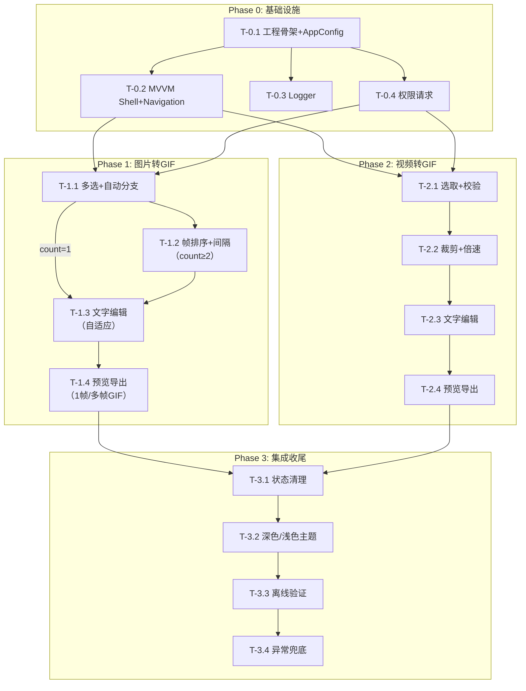

# 表情包制作 APP — 开发任务拆解与测试用例

> 平台：Android + iOS  
> 按功能领域拆分为 3 个 Phase，每个 Task 含独立测试用例，便于解耦开发与 Debug。

---

## Phase 0：基础设施（跨 Task 共享）

### T-0.1 工程骨架 + AppConfig

| 项 | 说明 |
|----|------|
| 依赖 | 无 |
| 产出 | Android: `app/` 模块 + Compose 入口 Activity；iOS: SwiftUI App 入口 |
| | `AppConfig.kt` / `AppConfig.swift`（见 `APP_DESIGN.md` §十一） |
| 说明 | `mediaType` 枚举：`VIDEO` / `PHOTO`；所有后续 Task 禁止硬编码数字 |

#### 测试用例

| ID | 场景 | 输入 | 预期 |
|----|------|------|------|
| UT-0.1.1 | 读取默认值 | `AppConfig.VIDEO_MAX_DURATION_SEC` | 返回 `30` |
| UT-0.1.2 | 读取数组型配置 | `AppConfig.SPEED_OPTIONS` | 返回 `[0.25, 0.5, 1.0, 1.5, 2.0]` |
| UT-0.1.3 | Quality 枚举映射 | `Quality.HIGH.width` / `.gifSample` | `640` / `3` |
| UT-0.1.4 | 编译期安全 | 代码中写 `AppConfig.FPS = 10` | 编译失败 |

---

### T-0.2 MVVM Shell + Navigation

| 项 | 说明 |
|----|------|
| 依赖 | T-0.1 |
| 产出 | `SharedViewModel`（state：mediaType=VIDEO\|PHOTO, trim, speed, quality, photos[], photoTexts[], frameDelay, gifBlob） |
| | MaterialPickScreen → 2 个入口路由（视频 / 图片转GIF） |
| | 顶部步骤指示器（视频 4 点 / 图片 count=1 时 3 点 / count≥2 时 4 点） |
| 说明 | ViewModel 中状态为 `MutableStateFlow`（Kotlin）/ `@Published`（Swift），跨页面保持 |

#### 测试用例

| ID | 场景 | 输入 | 预期 |
|----|------|------|------|
| UT-0.2.1 | 视频模式步骤数 | `mediaType = VIDEO` | 进度条 4 个点 |
| UT-0.2.2 | 图片单张步骤数 | `mediaType = PHOTO`, `photos.size = 1` | 进度条 3 个点 |
| UT-0.2.3 | 图片多张步骤数 | `mediaType = PHOTO`, `photos.size = 5` | 进度条 4 个点 |
| UT-0.2.4 | 前进保留状态 | Step 1 设置 `text=你好`, 点击下一步 | Step 2 中 `state.text` 仍为 `你好` |
| UT-0.2.5 | 后退保留状态 | Step 2→Step 1 返回 | 裁剪参数未丢失 |
| UT-0.2.6 | 导出中返回拦截 | `state.exporting = true` 时按返回 | 确认对话框 |
| UT-0.2.7 | 状态销毁重建恢复 | ViewModel 重建（模拟屏幕旋转） | 状态全部还原 |

---

### T-0.3 Logger 日志系统

| 项 | 说明 |
|----|------|
| 依赖 | T-0.1 |
| 产出 | `Logger.kt` / `os.Logger` extension |
| | 格式 `[大任务|Task] 描述 \| key=value` |
| 覆盖 | 视频转GIF / 图片转GIF / System 共 3 模块，30+ 操作 Tag |

#### 测试用例

| ID | 场景 | 输入 | 预期 |
|----|------|------|------|
| UT-0.3.1 | INFO 级别格式 | `EmojiLogger.info("图片转GIF","选取照片","照片已选取", "count" to 5)` | 输出 `[图片转GIF\|选取照片] 照片已选取 \| count=5` |
| UT-0.3.2 | Debug 模式输出 INFO | Debug 构建, `logger.info(...)` | logcat/Console.app 可见 |
| UT-0.3.3 | Release 抑制 INFO | Release 构建, `logger.info(...)` | 不输出 |
| UT-0.3.4 | Release 脱敏 | Release 模式含敏感参数 | 参数被移除或 `<masked>` |

---

### T-0.4 权限请求

| 项 | 说明 |
|----|------|
| 依赖 | T-0.1 |
| 产出 | `PermissionHelper.kt/swift` |
| 日志 | `[System|Permission]` |

#### 测试用例

| ID | 场景 | 输入 | 预期 |
|----|------|------|------|
| UT-0.4.1 | Android 33+ 免权限 | API 33+ 点击选取 | 直接打开 PhotoPicker |
| UT-0.4.2 | Android 29-32 请求权限 | API 30，权限未授予 | 弹出系统权限弹窗 |
| UT-0.4.3 | Android 29-32 拒绝权限 | 权限被拒绝 | Toast + 不进入选取 |
| UT-0.4.4 | iOS 14+ PHPicker | 点击选取 | 直接打开 PHPicker |

---

## Phase 1：图片转GIF

```
流程：选取照片（1~20张）
  count=1 → 文字编辑（3步）→ 预览 → 导出 1帧GIF
  count≥2 → 帧排序+间隔（4步）→ 逐张配文 → 轮播预览 → 导出多帧GIF
```

### T-1.1 图片多选 + 自动分支

| 项 | 说明 |
|----|------|
| 依赖 | T-0.2, T-0.4 |
| 产出 | `MaterialPickScreen` 图片入口：多选模式，过滤 `image/*`，上限 `{PHOTO_MAX_COUNT}` 张 |
| 分支 | count=1 → 直接跳转文字编辑（Step 1） |
| | count≥2 → 进入帧排序（Step 1） |
| 限制 | `count > {PHOTO_MAX_COUNT}` → Toast + 截取前 `{PHOTO_MAX_COUNT}` 张 |
| 日志 | `[图片转GIF|选取照片]` |

#### 测试用例

| ID | 场景 | 输入 | 预期 |
|----|------|------|------|
| UT-1.1.1 | 选 1 张 JPG | 相册选 1 张 JPG | `state.photos.size=1`，进入文字编辑（3步流程） |
| UT-1.1.2 | 选 1 张 PNG | 相册选 1 张 PNG | 同上 |
| UT-1.1.3 | 选 10 张 | 多选 10 张 | `state.photos.size=10`，进入帧排序（4步流程） |
| UT-1.1.4 | 边界值 20 张 | 恰好 20 张 | 进入帧排序，无警告 |
| UT-1.1.5 | 超限 25 张 | 选 25 张 | Toast + 截取前 20 张 |
| UT-1.1.6 | 最少 1 张 | 选 1 张 | 允许（1帧GIF） |
| UT-1.1.7 | 取消选取 | 打开选择器后取消 | 停留选取页 |
| UT-1.1.8 | 混合格式 | JPG+PNG+HEIC | 全部正常读取 |

---

### T-1.2 帧排序 + 间隔（count ≥ 2 时显示）

| 项 | 说明 |
|----|------|
| 依赖 | T-1.1（count ≥ 2） |
| 产出 | `PhotoOrderScreen`：缩略图网格 + 长按拖拽排序 + × 删除 + 追加 + 帧间隔滑块 + 实时预估 |
| 缓存 | ② `ThumbnailCache`：进入时后台预加载所有缩略图 |
| 帧间隔 | 滑块 `{FRAME_DELAY_MIN_MS}` ~ `{FRAME_DELAY_MAX_MS}`，默认 `{FRAME_DELAY_DEFAULT_MS}` |
| 日志 | `[图片转GIF|帧排序]` |

#### 测试用例

| ID | 场景 | 输入 | 预期 |
|----|------|------|------|
| UT-1.2.1 | 缩略图显示 | 选 10 张进入 | 网格 10 张 72×72dp |
| UT-1.2.2 | 拖拽排序 | 第 5 张拖到第 2 位 | 列表顺序更新 |
| UT-1.2.3 | 删除照片 | 点第 3 张 × | 剩余 9 张 |
| UT-1.2.4 | 删到 2 张 | 10 张删到 2 张 | 仍为 4 步流程 |
| UT-1.2.5 | 删到 1 张 | 2 张删到 1 张 | **自动切换**为 3 步流程（跳过帧排序） |
| UT-1.2.6 | 追加照片 | 追加 3 张 | 总数 13 张 |
| UT-1.2.7 | 追加超限 | 已 18 张追加 5 张 | Toast + 截取前 2 张 |
| UT-1.2.8 | 帧间隔滑块 | 500ms → 1500ms | 实时预估联动 |
| UT-1.2.9 | 实时预估 | 10 张, 500ms | "10 帧 / 5.0s / 约 XXKB" |
| UT-1.2.10 | ② 缩略图缓存 | 排序→配文→返回排序 | 缩略图即时显示 |

---

### T-1.3 文字编辑（自适应）

| 项 | 说明 |
|----|------|
| 依赖 | T-1.1（count=1）或 T-1.2（count≥2） |
| 产出 | `TextEditScreen` 自适应模式 |
| count=1 | 单帧预览 + 文字叠加层 + 全量控件（无导航器） |
| count≥2 | 照片导航器（← N/M →）+ 逐张配文 + 继承规则 |
| 共用 | 文字输入/字体/颜色/字号/拖拽控件复用同一组件 |
| 缓存 | ⑥ 文字预览分离 |

#### 测试用例

| ID | 场景 | 输入 | 预期 |
|----|------|------|------|
| UT-1.3.1 | count=1 输入文字 | 输入 "你好世界" | 预览叠加显示 |
| UT-1.3.2 | count=1 超出字数 | 输入 51 字 | 第 51 字被截断 |
| UT-1.3.3 | count=1 切换字体 | 选 "圆体" | 文字变圆体 |
| UT-1.3.4 | count=1 切换颜色 | 选红色 | 文字变红 |
| UT-1.3.5 | count=1 拖动文字 | 拖到 (0.2, 0.8) | 文字跟随移动 |
| UT-1.3.6 | count=1 双击居中 | 双击预览 | 回到 (0.5, 0.5) |
| UT-1.3.7 | count=1 字号极限 | 16px / 80px | 不溢出/不消失 |
| UT-1.3.8 | count=1 空文字导出 | 不输入文字 | 允许进入预览 |
| UT-1.3.9 | count≥2 第 3 张配文 | 导航到第 3 张，输入 "你好" | `photoTexts[2].content = "你好"` |
| UT-1.3.10 | count≥2 逐张独立 | 第 1 张 "A"、第 2 张 "B" | 切换时独立显示 |
| UT-1.3.11 | count≥2 导航器 | ← → 切换 | currentPhotoIdx 更新 |
| UT-1.3.12 | count≥2 边界导航 | 第 1 张 ← / 第 N 张 → | 不越界 |
| UT-1.3.13 | count≥2 继承规则 | 第 1 张 "你好"（楷体），第 2 张无，进第 3 张 | 第 3 张继承 "你好"（楷体） |
| UT-1.3.14 | count≥2 全空继承 | 所有无配文 | 默认空 + 默认字体 |
| UT-1.3.15 | ⑥ 缓存验证 | 拖动文字多次 | 不触发重新解码照片 |

---

### T-1.4 预览 + 导出

| 项 | 说明 |
|----|------|
| 依赖 | T-1.3 |
| 产出 | `PreviewExportScreen`：自适应预览 + 导出 |
| count=1 | 静态预览 → 导出 1 帧 GIF（`delay = GIF_DELAY_DIVISOR`） |
| count≥2 | 轮播预览（④ 预渲染）→ 导出多帧 GIF（`delay = frameDelay / GIF_DELAY_DIVISOR`） |
| 缓存 | ② 缩略图 / ③ 字体度量 / ⑤ 导出结果缓存 |
| 画质 | 固定 `{PHOTO_OUTPUT_WIDTH}`px |
| 日志 | `[图片转GIF|导出]` |

#### 测试用例

| ID | 场景 | 输入 | 预期 |
|----|------|------|------|
| UT-1.4.1 | count=1 导出 1 帧 GIF | 输入 "哈哈" | 相册出现 1 帧 GIF（静图） |
| UT-1.4.2 | count=1 文件名 | 导出时间 2026-01-15 14:30:00 | `emoji_20260115_143000.gif` |
| UT-1.4.3 | count≥2 轮播播放 | 5 张, 500ms | 每 500ms 自动切换 |
| UT-1.4.4 | count≥2 轮播联动配文 | 第 1 张 "A", 第 2 张 "B" | 文字随照片切换 |
| UT-1.4.5 | ④ 预渲染帧数 | 10 张进入 | `preRenderedFrames.size = 10` |
| UT-1.4.6 | ④ 修改文字重渲染 | 返回修改第 3 张 | 仅重渲染第 3 帧 |
| UT-1.4.7 | count≥2 正常导出 | 10 张, 500ms | 10 帧 GIF，帧延迟 500ms |
| UT-1.4.8 | 帧延迟换算 | frameDelay=750ms | GIF delay = 75（1/100s） |
| UT-1.4.9 | count=1 导出缓存命中 | 同参数导出两次 | 第二次 Toast "使用上次导出结果" |
| UT-1.4.10 | count≥2 导出缓存命中 | 同参数导出两次 | 同上 |
| UT-1.4.11 | 导出缓存 miss | 修改文字后再导出 | 正常重新编码 |
| UT-1.4.12 | 存储空间不足 | 模拟不足 | 弹窗提示 |
| UT-1.4.13 | 导出取消 | 编码中取消 | 清理临时文件 |
| UT-1.4.14 | 某张照片加载失败 | 第 5 张 URI 损坏 | `[图片转GIF|导出] error photoIdx=4` |

---

## Phase 2：视频转GIF

```
流程：选取视频（≤{VIDEO_MAX_DURATION_SEC}s） → 裁剪+倍速 → 文字编辑 → 预览 → 导出 GIF
步骤数：4 步
```

### T-2.1 视频选取 + 时长校验

| 项 | 说明 |
|----|------|
| 依赖 | T-0.2, T-0.4 |
| 产出 | `MaterialPickScreen` 视频入口：过滤 `video/*`，MediaStore/AVAsset.duration |
| 限制 | `duration > VIDEO_MAX_DURATION_SEC` → Toast 拒绝 |
| 日志 | `[视频转GIF|选取视频]` |

#### 测试用例

| ID | 场景 | 输入 | 预期 |
|----|------|------|------|
| UT-2.1.1 | 选取正常视频 | 15s MP4 | 进入裁剪 |
| UT-2.1.2 | 边界值 30s | 恰好 30.0s | 进入裁剪 |
| UT-2.1.3 | 超长视频 | 45s | Toast 拒绝 |
| UT-2.1.4 | 边界值 30.1s | 30.1s | Toast 拒绝 |
| UT-2.1.5 | 取消选取 | 打开选择器后取消 | 停留选取页 |
| UT-2.1.6 | 损坏视频 | duration 查询失败 | Toast "无法读取视频信息" |

---

### T-2.2 双滑块裁剪 + 倍速选择

| 项 | 说明 |
|----|------|
| 依赖 | T-2.1 |
| 产出 | `VideoTrimScreen`：视频帧预览区 + 双滑块 ≤`TRIM_MAX_DURATION_SEC` + 5 档倍速 + 实时预估 |
| 缓存 | ① `VideoFrameCache`：LRU，拖动滑块时命中 |
| 溢出 | 红色警告 + [缩短选段] / [均匀采样] |
| 日志 | `[视频转GIF|裁剪倍速]` |

#### 测试用例

| ID | 场景 | 输入 | 预期 |
|----|------|------|------|
| UT-2.2.1 | 默认裁剪范围 | 30s 视频 | 滑块 0s~10s |
| UT-2.2.2 | 拖动变更 | 左 3s, 右 8s | trimStart=3s, trimEnd=8s |
| UT-2.2.3 | 选段上限约束 | 拖动右滑块 > 10s | lock 在 trimStart+10s |
| UT-2.2.4 | 切换倍速 5 档 | 依次点击 | speed 更新，预估联动 |
| UT-2.2.5 | 实时预估 | speed=1x, trim=10s | "预计 80 帧 / 约 500KB" |
| UT-2.2.6 | 倍速联动 | 切到 2x | 帧数 80→40 |
| UT-2.2.7 | 帧溢出触发 | speed=0.25x, rawFrames=320 | 红色 + 两个按钮 |
| UT-2.2.8 | 缩短选段 | 点[缩短选段] | 时间轴闪烁 |
| UT-2.2.9 | 均匀采样 | 点[均匀采样] | 蓝色提示 + [取消采样] |
| UT-2.2.10 | 取消采样 | 点[取消采样] | 回到截断模式 |
| UT-2.2.11 | ① 帧缓存命中 | 拖动滑块回原位 | 不重新提取帧 |
| UT-2.2.12 | ① 缓存超限 | 提取 120 帧 | ≤100 帧，最旧淘汰 |
| UT-2.2.13 | ① 换视频清空 | 选新视频 | 旧缓存清空 |
| UT-2.2.14 | 片段预览 | 点[▶ 预览] | 按倍速循环播放 |

---

### T-2.3 视频文字编辑

| 项 | 说明 |
|----|------|
| 依赖 | T-2.2 |
| 产出 | `TextEditScreen`（视频模式）：中间帧 + 文字控件 |
| 缓存 | ⑥ `TextPreviewCache` |
| 控件 | 与 T-1.3 count=1 共用同一套输入/字体/颜色/字号/拖拽 |

#### 测试用例

| ID | 场景 | 输入 | 预期 |
|----|------|------|------|
| UT-2.3.1 | 文字控件全量 | — | 同 UT-1.3.1 ~ UT-1.3.8 |
| UT-2.3.2 | 中间帧显示 | 进入文字编辑 | 显示选中片段中间时间点的一帧 |
| UT-2.3.3 | ⑥ 分离缓存 | 拖动文字 | 背景帧不变，仅文字层重绘 |

---

### T-2.4 视频预览导出

| 项 | 说明 |
|----|------|
| 依赖 | T-2.3 |
| 产出 | `PreviewExportScreen`（视频模式）：播放预览 + 画质选择器（三档）+ 保存 |
| 导出流程 | 帧提取（含 ① 缓存）→ 逐帧加文字 → GIF 编码 → 保存 |
| 缓存 | ③ 字体度量 / ⑤ 导出结果缓存 |
| 日志 | `[视频转GIF|导出]` |

#### 测试用例

| ID | 场景 | 输入 | 预期 |
|----|------|------|------|
| UT-2.4.1 | 正常导出 | 5s@1x, 标准画质 | `emoji_*.gif`，40 帧 |
| UT-2.4.2 | 画质三档 | 流畅/标准/高清各导出一份 | 宽度 360/480/640 |
| UT-2.4.3 | 帧溢出截断 | 10s@0.5x | 60 帧 |
| UT-2.4.4 | 均匀采样 | 10s@0.5x uniform | 60 帧覆盖完整时段 |
| UT-2.4.5 | ③ 字体度量缓存 | 导出 60 帧 | 仅第一次 measure |
| UT-2.4.6 | ⑤ 导出缓存命中 | 同参数两次 | 第二次 Toast 命中 |
| UT-2.4.7 | 导出进度 | 60 帧 | 0→100%，UI 不冻结 |
| UT-2.4.8 | 导出超时 | 模拟卡死 > 15s | Toast "导出超时" |
| UT-2.4.9 | 存储不足 | 可用 100KB | 弹窗提示 |
| UT-2.4.10 | 导出中取消 | 编码 50% 取消 | 清理临时文件 |
| UT-2.4.11 | 导出中退后台 | 按 Home | 后台完成，前台恢复时提示 |

---

## Phase 3：集成与收尾

### T-3.1 跨模式跳转与状态清理

| 项 | 说明 |
|----|------|
| 依赖 | T-0.2, Phase 1, Phase 2 |
| 产出 | 导出成功页 → 回到 Step 0，清空上一轮 state，释放缓存 |

#### 测试用例

| ID | 场景 | 输入 | 预期 |
|----|------|------|------|
| UT-3.1.1 | 视频导出后选图片 | 视频导出完成 → 回首页 → 选图片 | state 完全重置 |
| UT-3.1.2 | 图片导出后选视频 | 图片导出完成 → 回首页 → 选视频 | photos/photoTexts 清空 |
| UT-3.1.3 | 缓存释放 | 图片流程结束 | ② 缩略图 + ④ 预渲染 释放 |

---

### T-3.2 深色/浅色主题

| 项 | 说明 |
|----|------|
| 依赖 | T-0.2 |
| 产出 | Material 3 / SwiftUI ColorScheme 自动跟随系统 |

#### 测试用例

| ID | 场景 | 输入 | 预期 |
|----|------|------|------|
| UT-3.2.1 | 深色模式 | 系统切深色 | App 跟随 |
| UT-3.2.2 | 浅色模式 | 系统切浅色 | App 跟随 |
| UT-3.2.3 | 色块不受影响 | 色彩选择器 6 色 | 始终固定 |

---

### T-3.3 离线可用验证

| 项 | 说明 |
|----|------|
| 依赖 | 全部 Task |
| 要求 | 无需注册、无需联网 |

#### 测试用例

| ID | 场景 | 输入 | 预期 |
|----|------|------|------|
| UT-3.3.1 | 飞行模式全流程 | 飞行模式 → 选素材 → 编辑 → 导出 | 全部正常 |
| UT-3.3.2 | 首次安装无网络 | 全新安装，关闭 Wi-Fi | App 正常打开 |

---

### T-3.4 Crash 与异常兜底

| 项 | 说明 |
|----|------|
| 依赖 | T-0.3 |
| 产出 | 全局未捕获异常拦截 → `[System|Crash]` + 友好提示 |

#### 测试用例

| ID | 场景 | 输入 | 预期 |
|----|------|------|------|
| UT-3.4.1 | 帧提取超时 | `getFrameAtTime` 阻塞 | 不崩溃，日志 error |
| UT-3.4.2 | GIF 编码异常 | 像素数据损坏 | 不崩溃，日志 error |
| UT-3.4.3 | 未捕获异常 | 模拟空指针 | 兜底捕获，`[System|Crash]` |

---

## 依赖关系图



---

## 测试统计

| Phase | Task 数 | 测试用例数 |
|-------|---------|-----------|
| 0 基础设施 | 4 | 19 |
| 1 图片转GIF | 4 | 47 |
| 2 视频转GIF | 4 | 34 |
| 3 集成收尾 | 4 | 11 |
| **合计** | **16** | **111** |

> Phase 1 与 Phase 2 之间**完全解耦**，可并行开发（各自内部严格顺序依赖）。  
> 日志 Tag 覆盖：视频转GIF（11 个操作点）、图片转GIF（10 个操作点）、System（5 个），共 26 个操作点均可用于 Debug 追踪。
