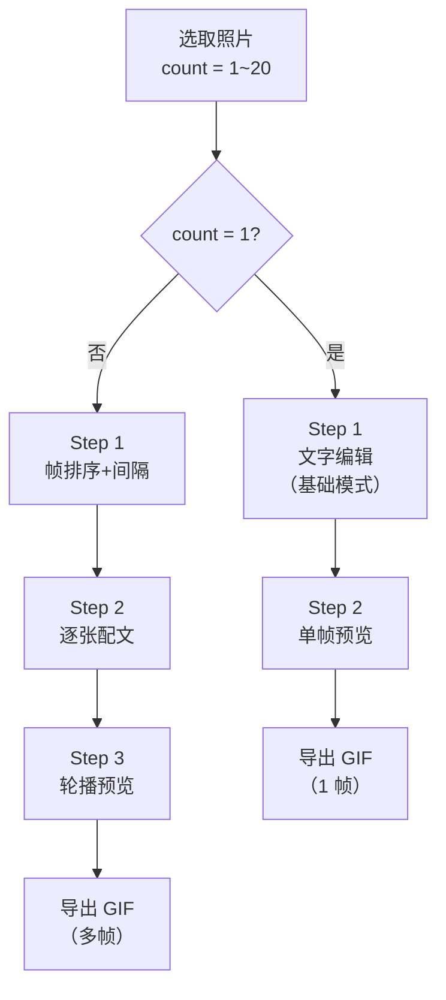

## 图片转GIF 统一模式 — 设计文档

### 一、合并前后对比

```
合并前:
┌──────────┐    ┌──────────┐
│ 照片模式  │    │ 连拍模式  │
│ 1 张照片  │    │ 1~20 张  │
│ 3 步      │    │ 4 步      │
│ 输出 PNG  │    │ 输出 GIF  │
└──────────┘    └──────────┘

合并后:
┌──────────────────────────┐
│       图片转GIF           │
│       1~20 张照片         │
│  count=1 → 3 步（智能跳）│
│  count≥2 → 4 步          │
│       输出 GIF            │
└──────────────────────────┘
```

### 二、分支决策



### 三、页面流程变化

| 步骤 | count=1（单张） | count≥2（多张） |
|------|----------------|-----------------|
| Step 0 | 素材选取（图片） | 素材选取（图片，多选） |
| Step 1 | ~~跳过~~ → 直接文字编辑 | 帧排序 + 间隔设置 |
| Step 2 | —— | 逐张配文（导航器 + 继承） |
| Step 3 | 预览 + 导出 | 轮播预览 + 导出 |
| 步骤标志 | ●○○ | ●○○○ |

### 四、状态模型

```kotlin
// SharedViewModel 简化
enum class MediaType { VIDEO, PHOTO }  // 移除 BURST

// 图片转GIF 通用字段
val photos: List<Uri>          // 1~20 张
val photoTexts: List<PhotoText?>  // 稀疏数组
var frameDelay: Int            // 帧间隔 ms（count=1 时隐藏控件，默认 0）
var currentPhotoIdx: Int       // 逐张配文时使用

// 派生
val isSinglePhoto: Boolean get() = photos.size == 1
val isMultiPhoto: Boolean get() = photos.size >= 2
```

### 五、单张 GIF 导出

单张照片输出 **1 帧 GIF89a** 而非 PNG。`frameDelay` 在 count=1 时内部设为 `GIF_DELAY_DIVISOR`（1/10s = 100ms），GIF 渲染器将其视为静态帧。

```kotlin
// 单张 GIF
val tempBitmap = loadAndScale(photoUri, AppConfig.PHOTO_OUTPUT_WIDTH)
val frame = drawTextOnBitmap(tempBitmap, textConfig)
gifEncoder.addFrame(frame, delay = AppConfig.GIF_DELAY_DIVISOR)  // 1 帧
val gifBytes = gifEncoder.finish()
// → 1 帧 GIF，在微信/QQ 中显示为"静图"，与 PNG 体验相同
```

### 六、移除项

| 项目 | 说明 |
|------|------|
| `exportPhotoPNG()` | 删除，统一用 GIF |
| `image-export` capability | 归档 |
| `MediaType.BURST` | 枚举值移除 |
| 照片模式画质选择器注释 | 已无照片模式，统一 480px |
| Phase 1 + Phase 3 分拆 | TASKS.md 合并为一个 Phase |

### 七、文档更新范围

| 文档 | 更新 |
|------|------|
| `APP_REQUIREMENTS.md` | §五（照片模式）+ §六（连拍 GIF）→ 合并为新 §五（图片转GIF）；§九 能力清单合并 SELECT-02/03、TEXT-06 调整；§三 入口表 3→2 |
| `APP_DESIGN.md` | §二 架构图/页面流程、§三 选取逻辑、§五 GifEncoder、§七 连拍→图片转GIF、§八 画质可见性 |
| `TASKS.md` | Phase 1 + Phase 3 合并为新 Phase 1，T-1.1 改为图片多选，删除 T-1.3 PNG 导出测试 |
| `AppConfig` | 不变（`PHOTO_OUTPUT_WIDTH` 已是 480px，适用单张+多张） |
